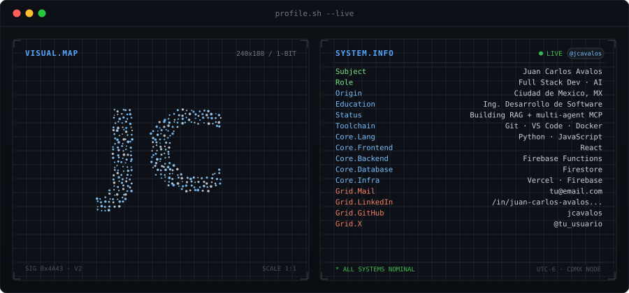
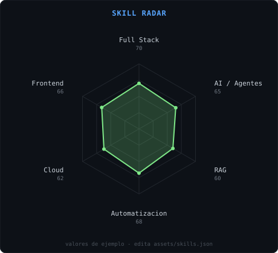
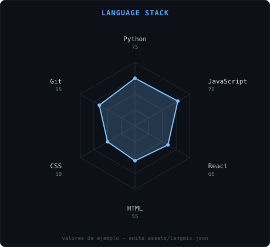
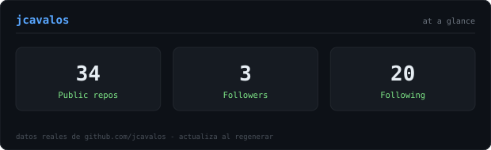

<!-- BANNER - terminal profile.sh --live -->

 

<!-- NOMBRE / TAGLINE - texto animado -->

 

<!-- REDES - reemplaza los usuarios de Instagram/X por los tuyos -->
&nbsp;&nbsp;
&nbsp;&nbsp;
&nbsp;&nbsp;

 

---

## This is me :)

Hola, soy **Juan Carlos**, Ingeniero en Desarrollo de Software full stack, apasionado
por la IA 🤖. Vivo entre líneas de código y libros, y me muevo principalmente con
Python y JavaScript.

- 🔍 Actualmente construyendo un **asistente con RAG**.
- 🧠 Desarrollando un **agente autónomo con memoria**.
- 🕸️ Armando un **sistema multi-agente con MCP**.
- 📚 Autodidacta por naturaleza: siempre buscando cómo automatizar procesos y
  experimentar con inteligencia artificial en mis proyectos personales.
- 💬 Escríbeme si quieres hablar de **IA aplicada, automatización o desarrollo full stack**.

> "El mejor código no es el que hace más cosas, sino el que le devuelve tiempo a quien lo usa."

 

## my perfect stack

---

## signals

<table>
<tr>
<td width="50%" align="center" valign="middle">

</td>
<td width="50%" align="center" valign="middle">

</td>
</tr>
</table>

---

## Numbers matter? ohhh yes.

---

` Build with love · jcavalos `

